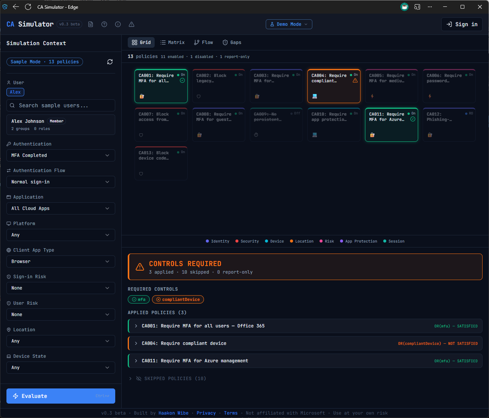
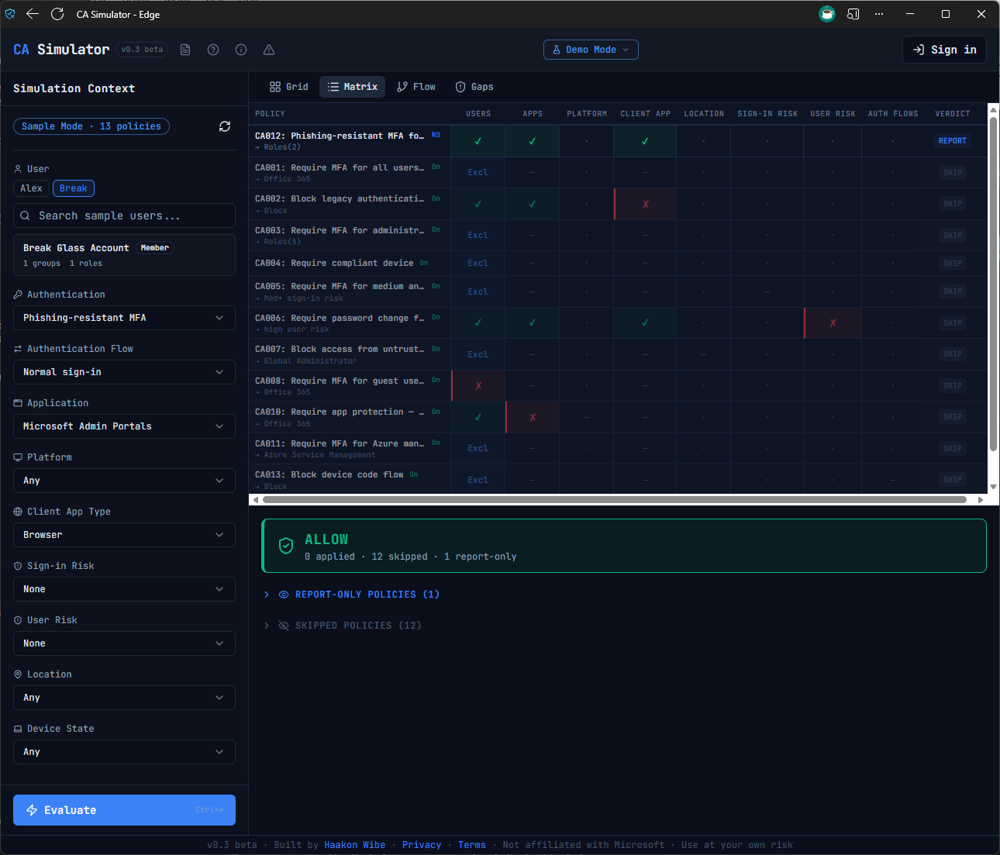
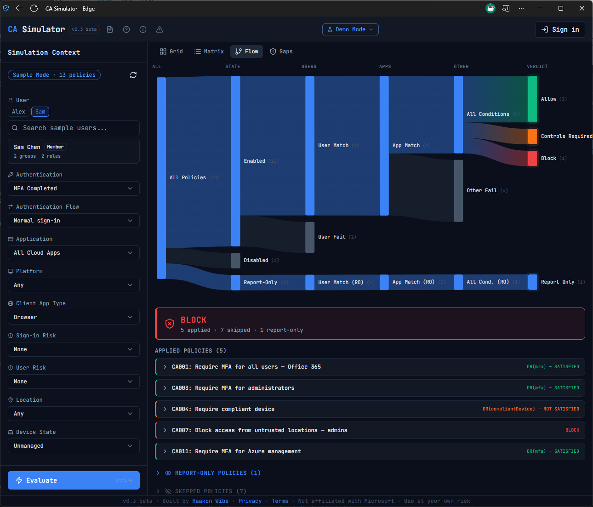
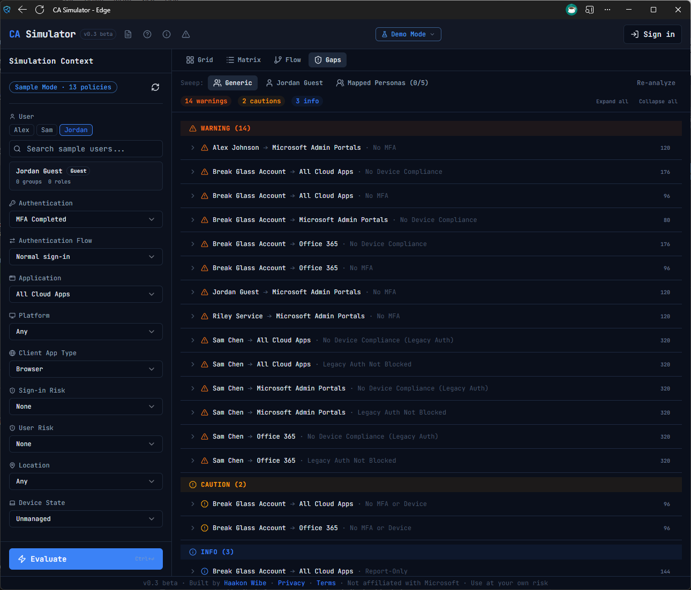

# CA Simulator

A Conditional Access policy simulator for Microsoft Entra ID. Evaluate sign-in scenarios against real or sample CA policies, see exactly why each policy matched or didn't, and find coverage gaps before attackers do.

<p align="center">
  
  
</p>
<p align="center">
  
  
</p>

## Why

Microsoft's built-in What If tool evaluates one scenario at a time with no visualization of the decision path. CA Simulator runs the same evaluation logic — verified by 343 unit tests — and adds four visualization modes, full condition-level tracing, and automated gap analysis that sweeps hundreds of scenario combinations to find unprotected paths.

## Features

- **Four visualization modes** — Grid (tile overview), Matrix (diagnostic heatmap), Flow (Sankey funnel), Gaps (coverage analysis)
- **Coverage gap analysis** — brute-force sweep across platforms, client apps, locations, and risk levels to find unprotected scenarios
- **Deterministic evaluation engine** — pure TypeScript, zero browser dependencies, matching Microsoft's What If tool
- **8 condition matchers** — User, Application, DevicePlatform, Location, ClientApp, Risk, DeviceFilter, AuthenticationFlow
- **Full evaluation trace** — see exactly which condition knocked out each policy
- **Sample mode** — 13 demo policies and 5 personas, no Azure tenant required
- **Live tenant connection** — MSAL + Microsoft Graph API with graceful admin consent handling

## Quick Start

```bash
git clone https://github.com/haakonwibe/ca-simulator.git
cd ca-simulator
npm install
npm run dev
```

Open `http://localhost:5173` and click **Use Sample Data** to explore immediately — no Azure tenant required.

## Live Tenant Connection

To evaluate your own tenant's policies:

1. Create a **Single-page application** registration in [Microsoft Entra ID](https://entra.microsoft.com/#view/Microsoft_AAD_RegisteredApps/ApplicationsListBlade)
2. Add redirect URI: `http://localhost:5173`
3. Set supported account types to **Accounts in any organizational directory** (multi-tenant)
4. Grant **delegated** API permissions:
   - `Policy.Read.All` — read CA policies
   - `Application.Read.All` — resolve app IDs to display names
   - `Directory.Read.All` — resolve users, groups, roles
   - `User.Read.All` — user search for persona selection
   - `GroupMember.Read.All` — transitive membership resolution
5. Copy `.env.example` to `.env` and add your client ID:
   ```bash
   cp .env.example .env
   # Edit .env: VITE_MSAL_CLIENT_ID=your-client-id-here
   ```
6. Run `npm run dev` and click **Sign In**

## How It Works

The evaluation engine processes each sign-in scenario through a 4-phase pipeline:

1. **Signal Collection** — capture the simulation context (user, app, device, platform, location, risk level, client app type, satisfied controls)
2. **Policy Matching** — evaluate each enabled policy's conditions using 8 independent matchers. Conditions are AND'd together; a policy applies only if all configured conditions match. Unconfigured conditions default to match-all.
3. **Grant Resolution** — resolve grant controls per-policy first (respecting each policy's AND/OR operator), then cross-policy AND: every applicable policy must be independently satisfied. Block in any policy always wins.
4. **Session Control Aggregation** — merge session controls from all applicable policies using most-restrictive-wins rules

Every step produces a trace entry, giving full visibility into why each policy was applied, skipped, or report-only.

## Visualization Modes

**Grid** — Tile-based overview of all policies, color-coded by category (Identity, Security, Device, Location, Risk, App Protection, Session). After evaluation, applied policies glow green/orange/red and skipped policies dim.

**Matrix** — Diagnostic heatmap with policies as rows and condition types as columns. Shows exactly which condition knocked out each policy. Rows sort by evaluation outcome.

**Flow** — Sankey diagram showing how policies funnel through six evaluation stages (All → State → Users → Apps → Other → Verdict). Policies exit the funnel at the stage where they fail. Report-only policies flow on a parallel track.

**Gaps** — Automated coverage gap analysis. Sweeps all combinations of platform, client app, location, and risk level to find unprotected scenarios. Classifies findings by severity (critical/warning/caution/info) and gap type (no-policy, no-MFA, no-device-compliance, legacy-auth). Supports generic personas, selected users, or guided 5-slot persona mapping.

## Architecture

```
Engine Layer       Pure TypeScript, zero dependencies, fully testable in isolation
                   8 condition matchers, 4-phase evaluation pipeline, 343 unit tests

Data Layer         MSAL authentication, Graph API policy fetch + pagination
                   Batch GUID resolution, named location lookup, persona search
                   Single normalization point from Graph API → typed engine models

State Layer        Zustand stores: policies, evaluation results, persona cache
                   Mode-agnostic — engine receives identical types from sample or live data

Visualization      React 18, Shadcn/UI + Tailwind CSS v4, D3 Sankey diagram
                   CSS Grid tiles, HTML heatmap table, gap analysis UI
```

The engine is a standalone TypeScript module with no knowledge of React, the DOM, or Microsoft Graph. It takes policy data and a simulation context as input and produces structured evaluation results with a full trace as output.

## Development

```bash
npm run dev          # Vite dev server with HMR
npm test             # Run all 343 engine tests
npm run test:watch   # Watch mode
npm run build        # Production build
```

Run a single test file:

```bash
npx vitest run src/engine/__tests__/conditions/UserConditionMatcher.test.ts
```

The engine is tested independently of the UI. Each of the 8 condition matchers has its own test file, plus integration tests for the policy evaluator, grant resolver, session aggregator, full engine, and gap analysis.

The `/privacy` and `/terms` routes rely on Vercel's clean URL rewrites. Locally, use `/privacy/index.html` and `/terms/index.html` instead.

## Tech Stack

TypeScript (strict) · React 18 · Vite · Tailwind CSS v4 · Shadcn/UI · Zustand · D3 (d3-sankey) · MSAL.js · Vitest

## License

[MIT](LICENSE)
