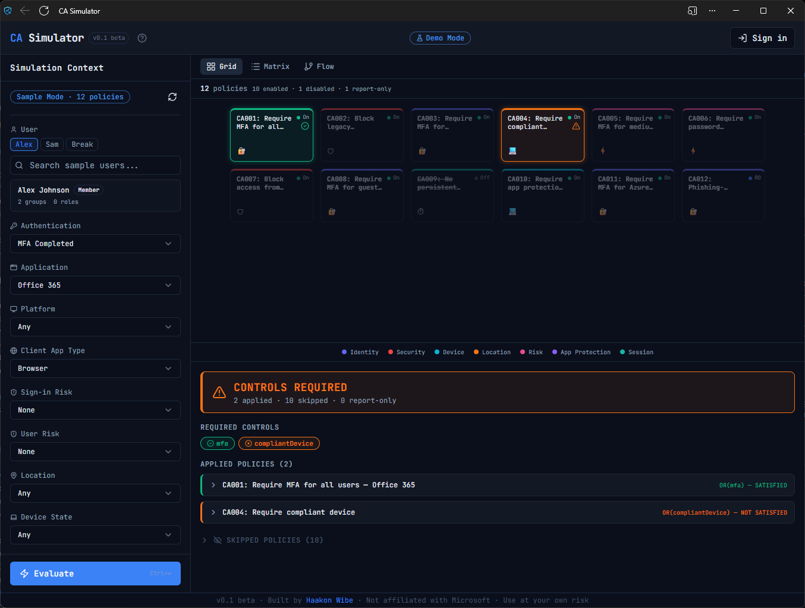
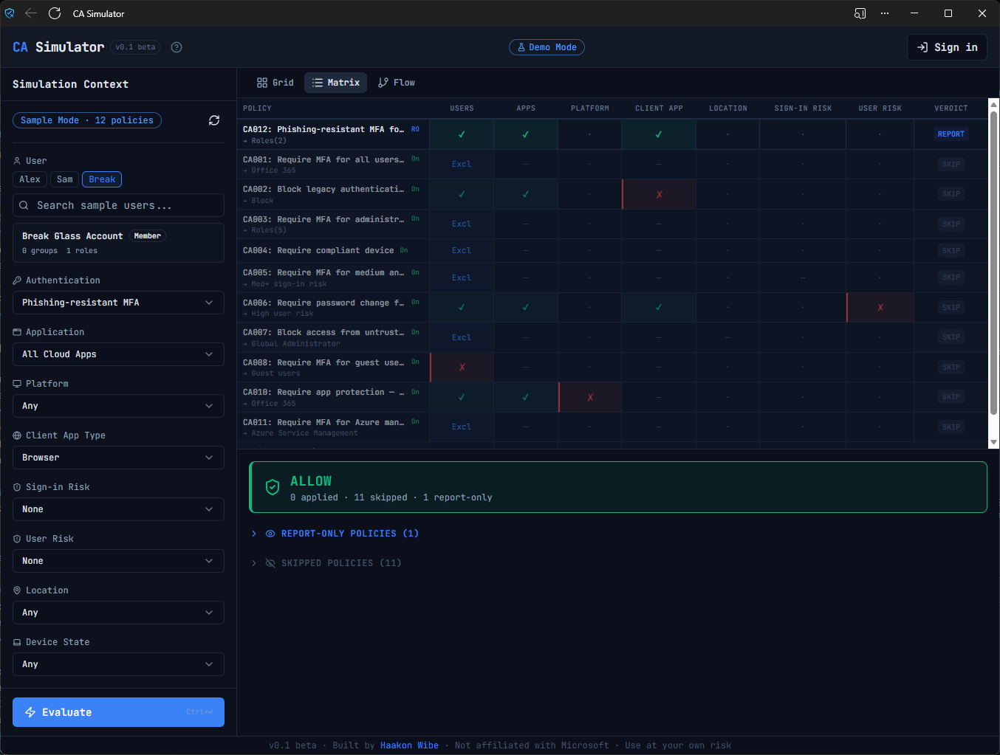
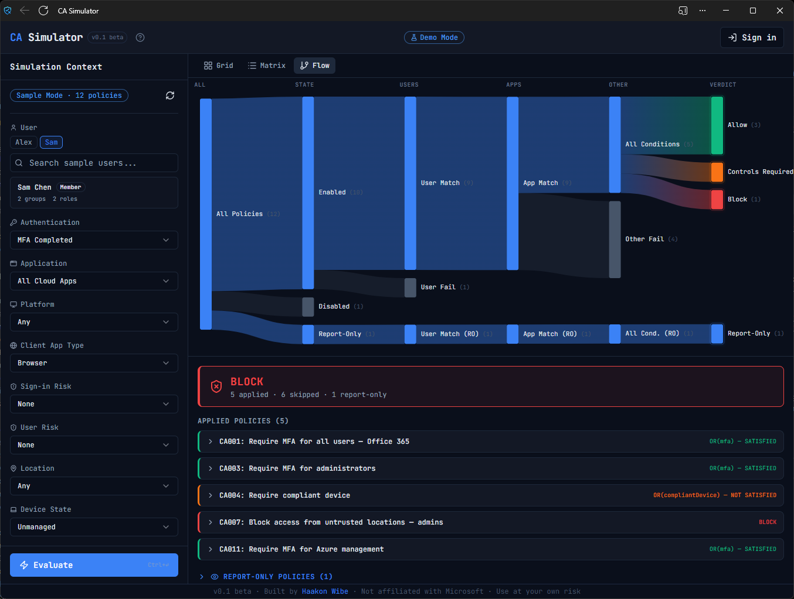

# CA Simulator

A Conditional Access policy simulator for Microsoft Entra ID. Evaluate sign-in scenarios — including Entra Agent ID agent identities — against real or sample CA policies, experiment safely in a sandbox, assess against Microsoft's baseline recommendations, and export deployment-ready change plans.

<p align="center">
  
  
  
</p>

## Features

- **Six analysis views** — Grid (tile overview), Matrix (diagnostic heatmap), Flow (Sankey funnel), Gaps (coverage analysis), Impact (policy removal assessment), and Baseline (Microsoft template assessment)
- **Policy sandbox** — toggle any policy On/Report-only/Off, edit scoping (users, groups, roles, apps, agent identities), and draft policies from Microsoft templates; every view evaluates the hypothetical state, with a sandbox-vs-live diff across the full scenario sweep
- **Baseline assessment** — 21 outcome-based checks against Microsoft's CA templates and recommendations, including an AI Agents category, with one-click Fix-in-Sandbox template drafts
- **Change plan export** — the entire sandbox state as a Markdown summary, Microsoft Graph PowerShell script, and Graph-ready policy JSON, generated locally; the app never writes to the tenant
- **Agent identity support** — simulate all three Entra Agent ID patterns (agent identities, agent user accounts, users accessing agent resources) with the documented isolation semantics; agent policies load with real targeting via the Graph beta endpoint and carry dedicated agent scenario grids through the diff and impact analysis
- **Impact analysis** — "What if I disabled this policy?" for every enabled policy, with weighted security posture scoring, contextual fallback detection, affected user breakdown, and agent-aware severity
- **Coverage gap analysis** — brute-force sweep across platforms, client apps, locations, and risk levels to find unprotected scenarios
- **Tenant app discovery** — Application dropdown shows all enterprise apps and app registrations from your tenant, not just policy-referenced apps
- **Precise scenario modelling** — device compliance and join type as independent controls (Entra joined, hybrid joined, registered, unregistered), authentication strength tiered against Microsoft's built-in strength definitions, and every scenario option described in place
- **Deterministic engine** matching Microsoft's What If tool — 741 unit tests verify accuracy
- **11 condition matchers** — User, Application, DevicePlatform, Location, ClientApp, Risk, DeviceFilter, AuthenticationFlow, InsiderRisk, ClientApplications (agents), AgentRisk
- **Guided tour** — on a first visit, coach marks introduce each part of the interface in turn: where to load policies, where to describe a sign-in, and what sits behind each of the six tabs. Replayable at any time from the header
- **Sample mode** for instant demo — 23 policies and 6 personas, no Azure tenant required
- **Live tenant connection** via MSAL + Microsoft Graph API
- **Graceful permission handling** — friendly admin consent banner when tenant permissions are missing
- **Privacy by construction** — your tenant data never leaves the browser; anonymous usage events come from a fixed, published allowlist that cannot carry policy names, identifiers, or results, and can be switched off in-app or via Do Not Track
- **Pure TypeScript engine** with zero browser dependencies, fully testable in isolation

## Quick Start

```bash
git clone https://github.com/haakonwibe/conditional-access-simulator.git
cd conditional-access-simulator
npm install
npm run dev
```

Open `http://localhost:5173` and click **Use Sample Data** to explore with 23 demo policies and 6 personas — no Azure tenant required.

## Live Tenant Connection

To connect to your own Microsoft Entra ID tenant:

1. Create a **Single-page application** registration in [Microsoft Entra ID](https://entra.microsoft.com/#view/Microsoft_AAD_RegisteredApps/ApplicationsListBlade)
2. Add redirect URI: `http://localhost:5173`
3. Set supported account types to **Accounts in any organizational directory** (multi-tenant)
4. Grant **delegated** API permissions:
   - `Policy.Read.All` — read CA policies, named locations, authentication strengths
   - `Directory.Read.All` — resolve users, groups, roles, and applications (also covers user search and membership resolution)
5. Copy `.env.example` to `.env` and add your client ID:
   ```bash
   cp .env.example .env
   # Edit .env: VITE_MSAL_CLIENT_ID=your-client-id-here
   ```
6. Run `npm run dev` and click **Sign In**

## Visualization Modes

**Grid** — Tile-based overview of all policies, color-coded by category (Identity, Security, Device, Location, Risk, App Protection, Session). After evaluation, applied policies glow green/orange/red, skipped policies dim.

**Matrix** — Diagnostic heatmap with policies as rows and condition types as columns. Shows exactly which condition knocked out each policy. Knockout cells are emphasized, and rows sort by evaluation outcome.

**Flow** — Sankey/alluvial diagram showing how policies funnel through six evaluation stages (All → State → Users → Apps → Other → Verdict). Policies exit the funnel at the stage where they fail. Report-only policies flow on a parallel track.

**Gaps** — Automated coverage gap analysis. Sweeps all combinations of platform, client app, location, and risk level to find unprotected scenarios. Classifies findings by severity (critical/warning/caution/info) and gap type (no-policy, no-MFA, no-device-compliance, legacy-auth). Supports generic personas, selected users, or guided 5-slot persona mapping.

**Impact** — Policy removal impact assessment. For every enabled policy, the engine removes it and re-evaluates all 5,760 scenario combinations, plus dedicated agent grids for agent-targeting policies. Shows weighted security posture score changes, verdict transitions, affected user types, coverage gaps created, contextual fallback analysis (which other policies still protect you and what they cover), and other active protection. Policies are ranked by severity: Critical (verdict changes or agent protection loss), High (controls lost), Medium (partial degradation), Low (fully covered by other policies).

**Baseline** — Outcome-based assessment against Microsoft's CA templates and recommendations: 23 checks across Secure Foundation, Zero Trust, Remote Work, Protect Administrators, Emerging Threats, and AI Agents. Checks run targeted scenarios through the engine and require the protection to be guaranteed, with report-only detection and one-click Fix-in-Sandbox template drafts.

**Sandbox** — A mode, not a view: the header switch puts the whole app into a hypothetical state. Toggle policy states, edit scoping, draft policies from templates; every view evaluates the sandboxed set, with a sandbox-vs-live diff panel and a local change-plan export (Markdown / Graph PowerShell / JSON).

## Architecture

```
Engine Layer     Pure TypeScript, zero dependencies
                 11 condition matchers, identity-type gate (user/agent),
                 4-phase evaluation pipeline — 701 unit tests

Data Layer       MSAL authentication (loginRedirect flow)
                 Graph API: policy fetch (beta endpoint — v1.0 strips agent
                 targeting), GUID resolution, persona search
                 Tenant app discovery (enterprise apps + app registrations)
                 Normalization from Graph API to typed engine models

Analysis         Impact analysis — per-policy removal with weighted scoring
                 Coverage gap analysis — brute-force scenario sweep
                 Baseline assessment — 21 outcome-based template checks
                 Sandbox — state/scoping overrides, drafts, sweep diff
                 Change plan export — Graph PowerShell / JSON / Markdown
                 Persona mapping — 5-slot guided user assignment

Visualization    React 18, Zustand state, Shadcn/UI components
                 D3 Sankey diagram, CSS Grid tiles, HTML heatmap table
```

The engine is a standalone TypeScript module. It takes policy data and a simulation context as input, produces structured evaluation results as output, and has no knowledge of React, the DOM, or Microsoft Graph.

## Tech Stack

TypeScript (strict) · React 18 · Vite · Tailwind CSS v4 · Shadcn/UI · Zustand · D3 (d3-sankey) · MSAL.js · Vitest

## Testing

```bash
npm test        # Run all 701 engine tests
npm run build   # Production build
```

The engine is tested independently of the UI. Each condition matcher has its own test file, plus integration tests for the policy evaluator, grant resolver, session aggregator, agent identity isolation rules, full engine, gap analysis, impact analysis, baseline assessment (including a template self-test loop), sandbox overrides, change plan export, and the analytics event allowlist.

## License

[MIT](LICENSE)
