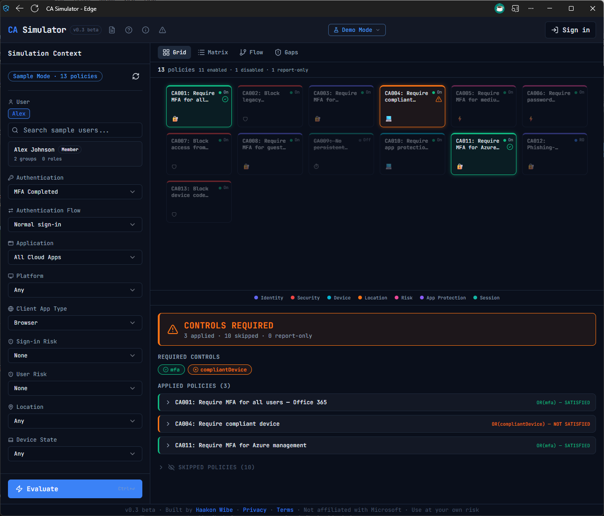
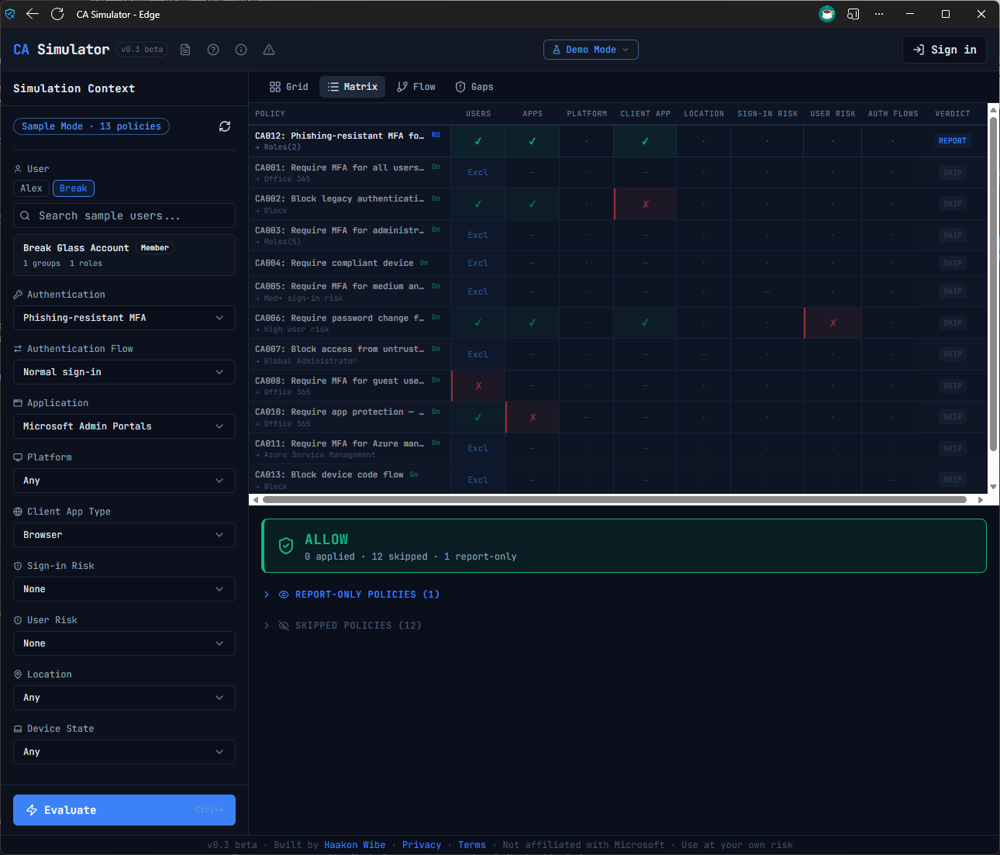
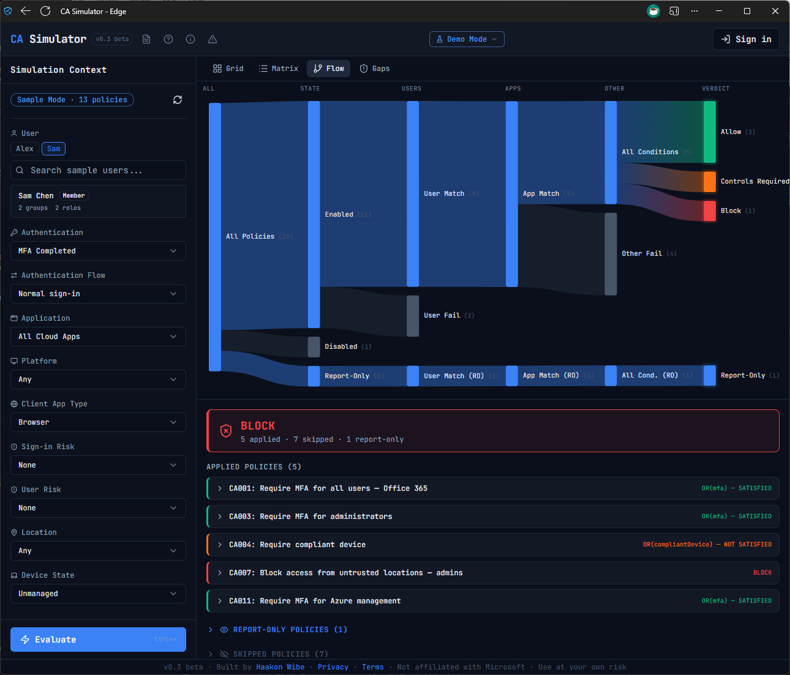
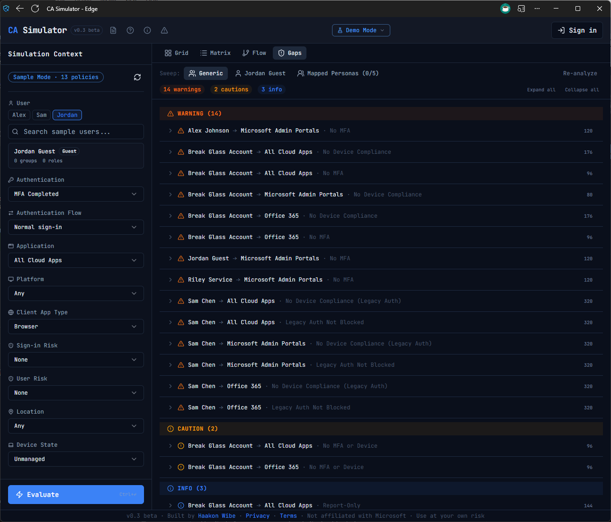

# CA Simulator

A Conditional Access policy simulator for Microsoft Entra ID. Evaluate sign-in scenarios against real or sample CA policies, see exactly why each policy matched or didn't, and find coverage gaps before attackers do.

<p align="center">
  
  
</p>
<p align="center">
  
  
</p>

## Why

Microsoft's built-in What If tool evaluates one scenario at a time with no visualization of the decision path. CA Simulator runs the same evaluation logic — verified by 500+ unit tests — and adds four visualization modes, full condition-level tracing, and automated gap analysis that sweeps hundreds of scenario combinations to find unprotected paths.

## Features

- **Six analysis views** — Grid (tile overview), Matrix (diagnostic heatmap), Flow (Sankey funnel), Gaps (coverage analysis), Impact (policy removal analysis), Baseline (Microsoft template assessment)
- **Baseline assessment** — 18 checks drawn from Microsoft's Conditional Access policy templates, judged by outcome: each check runs targeted scenarios through the engine and verifies the protection is actually guaranteed. Flags policies that are configured but stuck in report-only mode
- **Policy sandbox** — toggle any policy between enabled, report-only, and disabled, and edit policy scoping: remove any included or excluded user, group, role, or app, and add users and applications. Every view reflects the hypothetical state before you touch the tenant. The diff panel sweeps all 5,760 scenarios through both the live and sandboxed sets, showing posture delta, newly blocked/allowed scenarios, affected user types, and per-field scoping changes
- **Impact analysis** — "What if I disabled this policy?" Remove each enabled policy and re-evaluate all 5,760 scenario combinations. Policies classified as Critical/High/Medium/Low severity based on verdict changes, control loss, and fallback existence
- **Weighted security posture score** — each scenario scored 0–10 based on enforced controls; see how your posture changes when a policy is removed
- **Contextual fallback analysis** — when disabling a policy creates a gap, see which other policies still provide protection, what remains, and what is lost
- **Coverage gap analysis** — brute-force sweep across platforms, client apps, locations, and risk levels to find unprotected scenarios
- **Deterministic evaluation engine** — pure TypeScript, zero browser dependencies, matching Microsoft's What If tool
- **9 condition matchers** — User, Application, DevicePlatform, Location, ClientApp, Risk, InsiderRisk, DeviceFilter, AuthenticationFlow
- **Full tenant app discovery** — application dropdown shows all enterprise applications and app registrations from your tenant, not just apps referenced in policies
- **Authentication strength hierarchy** — built-in and custom strengths resolved with hierarchy-aware matching. Custom strengths are classified into tiers (MFA, Passwordless, Phishing-resistant) based on their allowed combinations
- **Target resource modes** — simulate against cloud apps, User Actions (security info registration, device registration), or Authentication Contexts (C1–C3)
- **Session controls in verdict** — aggregated session controls displayed with source policy links, including token protection (secureSignInSession)
- **Full evaluation trace** — see exactly which condition knocked out each policy
- **Sample mode** — 19 demo policies and 5 personas covering every engine feature, no Azure tenant required
- **Live tenant connection** — MSAL + Microsoft Graph API with graceful admin consent handling

## Quick Start

```bash
git clone https://github.com/haakonwibe/ca-simulator.git
cd ca-simulator
npm install
npm run dev
```

Open `http://localhost:5173` and click **Use Sample Data** to explore immediately — no Azure tenant required.

### Docker

Alternatively, run the application in a Docker container:

```bash
docker-compose up -d
```

Open `http://localhost:5173` and click **Use Sample Data** to explore.

## Live Tenant Connection

To evaluate your own tenant's policies:

1. Create a **Single-page application** registration in [Microsoft Entra ID](https://entra.microsoft.com/#view/Microsoft_AAD_RegisteredApps/ApplicationsListBlade)
2. Add redirect URI: `http://localhost:5173`
3. Set supported account types to **Accounts in any organizational directory** (multi-tenant)
4. Grant **delegated** API permissions:
   - `Policy.Read.All` — read CA policies, named locations, and authentication strengths
   - `Directory.Read.All` — resolve users, groups, roles, and applications (covers user search, transitive membership, and app discovery)
5. Copy `.env.example` to `.env` and add your client ID:
   ```bash
   cp .env.example .env
   # Edit .env: VITE_MSAL_CLIENT_ID=your-client-id-here
   ```
6. Run `npm run dev` and click **Sign In**

## How It Works

The evaluation engine processes each sign-in scenario through a 4-phase pipeline:

1. **Signal Collection** — capture the simulation context (user, app, device, platform, location, risk levels, insider risk, client app type, authentication strength level, custom auth strength map, satisfied controls)
2. **Policy Matching** — evaluate each enabled policy's conditions using 9 independent matchers. Conditions are AND'd together; a policy applies only if all configured conditions match. Unconfigured conditions default to match-all.
3. **Grant Resolution** — resolve grant controls per-policy first (respecting each policy's AND/OR operator), then cross-policy AND: every applicable policy must be independently satisfied. Block in any policy always wins. Custom authentication strengths are resolved via the tenant's auth strength policies.
4. **Session Control Aggregation** — merge session controls from all applicable policies using most-restrictive-wins rules. Includes sign-in frequency, persistent browser, cloud app security, continuous access evaluation, app-enforced restrictions, resilience defaults, and token protection.

Every step produces a trace entry, giving full visibility into why each policy was applied, skipped, or report-only.

## Visualization Modes

**Grid** — Tile-based overview of all policies, color-coded by category (Identity, Security, Device, Location, Risk, App Protection, Session). After evaluation, applied policies glow green/orange/red and skipped policies dim.

**Matrix** — Diagnostic heatmap with policies as rows and condition types as columns. Shows exactly which condition knocked out each policy. Rows sort by evaluation outcome.

**Flow** — Sankey diagram showing how policies funnel through six evaluation stages (All → State → Users → Apps → Other → Verdict). Policies exit the funnel at the stage where they fail. Report-only policies flow on a parallel track.

**Gaps** — Automated coverage gap analysis. Sweeps all combinations of platform, client app, location, and risk level to find unprotected scenarios. Classifies findings by severity (critical/warning/caution/info) and gap type (no-policy, no-MFA, no-device-compliance, legacy-auth). Supports generic personas, selected users, or guided 5-slot persona mapping. Uses full-width layout with inline user picker.

**Impact** — Policy removal impact analysis. For every enabled policy, the engine removes it and re-evaluates all 5,760 scenario combinations to measure the effect. Shows a weighted security posture score, affected user breakdown (red/green pills by user type), contextual fallback analysis identifying which other policies still cover the gap, and "other protection active" cards. Policies are classified as Critical, High, Medium, or Low severity.

**Sandbox** — Not a view but a mode: the header switch puts the whole app into a hypothetical state. Toggle policy states on the Grid tiles or detail panel, edit assignments inline (removable chips for every included/excluded user, group, role, and app; add users via search and apps from the tenant catalog), and every view evaluates the sandboxed set — with a change-tracking bar, ghost chips with undo for removed entries, amber modified markers on Grid tiles, a sandbox-vs-live diff panel itemizing scoping changes by field, and a verdict banner line showing what the live tenant does today whenever results differ.

**Baseline** — Assessment against Microsoft's Conditional Access policy templates across Secure Foundation, Zero Trust, Remote Work, Protect Administrators, and Emerging Threats. Verdicts are outcome-based — checks run targeted scenarios through the engine and require the protection to be guaranteed, so scope holes and OR-grant loopholes are caught. Report-only policies that would satisfy a check are called out by name, and with sandbox mode active you can promote one and watch the check pass. License-gated checks (Entra ID P2, Purview) are labeled and filterable.

## Architecture

```
Engine Layer       Pure TypeScript, zero dependencies, fully testable in isolation
                   9 condition matchers, 4-phase evaluation pipeline, 400+ unit tests

Data Layer         MSAL authentication, Graph API policy fetch + pagination
                   Batch GUID resolution, named location lookup, persona search
                   Single normalization point from Graph API → typed engine models

State Layer        Zustand stores: policies, evaluation results, persona cache
                   Mode-agnostic — engine receives identical types from sample or live data

Visualization      React 18, Shadcn/UI + Tailwind CSS v4, D3 Sankey diagram
                   CSS Grid tiles, HTML heatmap table, gap analysis UI, impact analysis UI
```

The engine is a standalone TypeScript module with no knowledge of React, the DOM, or Microsoft Graph. It takes policy data and a simulation context as input and produces structured evaluation results with a full trace as output.

## Development

```bash
npm run dev          # Vite dev server with HMR
npm test             # Run all 400+ engine tests
npm run test:watch   # Watch mode
npm run build        # Production build
```

Run a single test file:

```bash
npx vitest run src/engine/__tests__/conditions/UserConditionMatcher.test.ts
```

The engine is tested independently of the UI. Each of the 9 condition matchers has its own test file, plus integration tests for the policy evaluator, grant resolver, session aggregator, authentication strength hierarchy, full engine, gap analysis, and impact analysis.

The `/privacy` and `/terms` routes rely on Vercel's clean URL rewrites. Locally, use `/privacy/index.html` and `/terms/index.html` instead.

## Tech Stack

TypeScript (strict) · React 18 · Vite · Tailwind CSS v4 · Shadcn/UI · Zustand · D3 (d3-sankey) · MSAL.js · Vitest

## License

[MIT](LICENSE)
